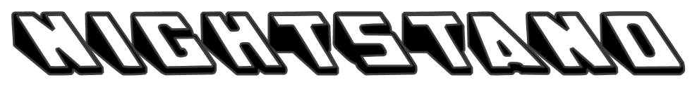

[](https://cocoapods.org/pods/Nightstand)
[](https://cocoapods.org/pods/Nightstand)


## What is it?
Nightstand is a fully customizable and convenient way to construct static table views for iOS. It removes the need to implement delegate and datasource methods; just construct your rows and sections, and configure them how you please. Nightstand takes care of the rest.

Nightstand allows you use built-in cell types, or custom cell types. You can also use your existing UIViewControllers or UITableViewControllers just by having them conform to the necessary protocol.

## Why use it?
Traditional table view implementations can become unwieldy since they require logic to be spread across multiple delegate and data source methods. When we work with static tables, it’s much easier to think in terms of **sections** and **rows**, rather than in terms of delegates and data sources.

Nightstand allows you to construct an entire table by just defining a collection of sections and rows, without having to work with delegate or data source methods. This allows you to think more statically about your table views.

One of the most interesting features of Nightstand is that it allows you define and use your own UITableViewCells, so the possibilites are limitless.

## Rows
Nightstand’s **Row** type represents a single row within a section. A **Row** can be one of the built in types: **Default, Subtitle, Value1, or Value2**

```swift
let row = Row<DefaultTableViewCell>(...)
```

or a **Row** can be a custom cell type that you define.

```swift
let row = Row<UserTableViewCell>(...)
```

A **Row** has a **Model**, **Actions**, and a **Configuration**.
* A row’s **Model** defines the data that the row will use to populate its views.

```swift
let model = DefaultTableViewCell.Model(text: "Hello World", image: nil)
```

* A row’s **Actions** define what happens when it is selected or (optionally) when its accessory view is selected.

```swift
let actions = TableViewCellActions(didSelectCell: { navigateToAnotherView() },
                             didTapAccessoryView: { displayAlert() })
```

* A row’s **Configuration** defines its style.

```swift
var configuration = TableViewCellConfiguration()
configuration.selectionStyle = .none
configuration.accessoryType = .detailButton
```

## Sections
Nightstand’s **Section** type represents a single section within a table.

```swift
let section = Section(title: "Hello World",
                        rows: [
                            Row<DefaultTableViewCell>(...),
                            Row<Value1TableViewCell>(...),
                            Row<UserTableViewCell>(...) ])
```

## Putting it all together
Once you’ve defined your **Row**s and **Section**s, you can use them to initialize your Nightstand:

```swift
let nightstand = Nightstand(sections: sections)
```
  
**Nightstand** conforms to `UITableViewDelegate` and `UITableViewDataSource`, and is extended to have default implementations for all of the supported methods. Your only job is to set the `Nightstand` as the `UITableView`'s data source and delegate.
  
```swift
tableView.dataSource = nightstand
tableView.delegate = nightstand
```
  
Nightstand will take care of the rest.

If you're having any trouble, or want to see more code, please refer to the example project. To run the example project, clone the repo, and run `pod install` from the Example directory first.

## Creating Custom Cells

It's possible to use your own UITableViewCells in a Nightstand table. Make sure that your cell defines the following initializer:

```swift
override init(style: UITableViewCell.CellStyle, reuseIdentifier: String?) {
    super.init(style: style, reuseIdentifier: UserTableViewCell.reuseIdentifier)
        
    // You can add any additional initialization logic here
}
```

Nightstand extends UITableViewCell so that it has a `reuseIdentifier` by default. In fact, the above initializer is all you need in order to implement cell reuse.

The next thing you'll need to do is have your cell conform to the `Configurable` protocol. This protocol has two requirements:

```swift
associatedtype Model
func configure(with model: Model)
```

You can define your cell's Model explicitly like so:

```swift
extension UserTableViewCell {
    struct Model {
        var name: String
        var age: Int?
        var image: UIImage?
    }
}
```

You can also use a model from another part of your application:

```swift
extension UserTableViewCell: Configurable {
    typealias Model = SomeOtherModel
}
```

Then you just need to implement the required method:

```swift
extension UserTableViewCell: Configurable {
    func configure(with model: Model) {
        nameLabel.text = model.name
        ageLabel.text = String(age)
        profileImageView.image = image
    }
}
```

## Installation

For swift 4.2 support, please use version 0.1.0

### CocoaPods

CocoaPods is a dependency manager for Cocoa projects. To install Nightstand with CocoaPods:

Update your Podfile to include the following:

```ruby
use_frameworks!

pod 'Nightstand'
```

Run pod install.

### Carthage

Coming Soon

## How can I report an issue?
Please report any issues using GitHub Issues

## How can I contribute?
Please open a Pull Request for any minor fixes or contributions. For any major contributions or ideas, feel free to contact me or open an issue and I'd be happy to discuss it with you.

## Author

Tyler Neveldine, tneveldine@gmail.com

## License

Nightstand is available under the MIT license. See the LICENSE file for more info.
